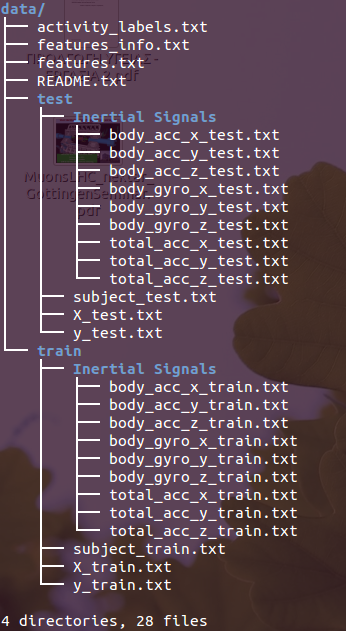

Getting and Cleaning Data - Project
===================================

Data Reference
==============

A full description of the analyzed data is available at:

http://archive.ics.uci.edu/ml/datasets/Human+Activity+Recognition+Using+Smartphones 

Getting Data
============

1. Clone this repository to your local working area.
2. Download the [dataset](https://d396qusza40orc.cloudfront.net/getdata%2Fprojectfiles%2FUCI%20HAR%20Dataset.zip). You can also use the "wget" command as follows

   `wget https://d396qusza40orc.cloudfront.net/getdata%2Fprojectfiles%2FUCI%20HAR%20Dataset.zip`

3. Extract with unzip:

   `unzip getdata%2Fprojectfiles%2FUCI\ HAR\ Dataset.zip`   

   The last action should result in a `UCI HAR Dataset` folder that contains all data files in the required structure.

4. Rename the current directory to `data`

   `mv UCI\ HAR\ Dataset/ data`

5. Run the script 'run_analysis.R` in R:

   
Data Structure
==============

Running the command `tree data/` you should be able to see the following result:

Project Requirements
====================

The R script called `run_analysis.R` should be able to do the following:
1. Merges the training and the test sets to create one data set.
2. Extracts only the measurements on the mean and standard deviation for each measurement. 
3. Uses descriptive activity names to name the activities in the data set
4. Appropriately labels the data set with descriptive activity names. 
5. Creates a second, independent tidy data set with the average of each variable for each activity and each subject. The processed dataset named `processedData.txt`
should be  stored in the working directory.

   

